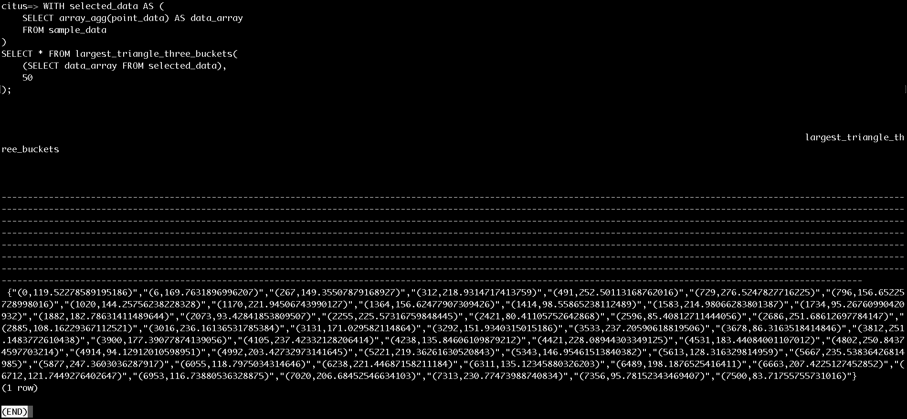
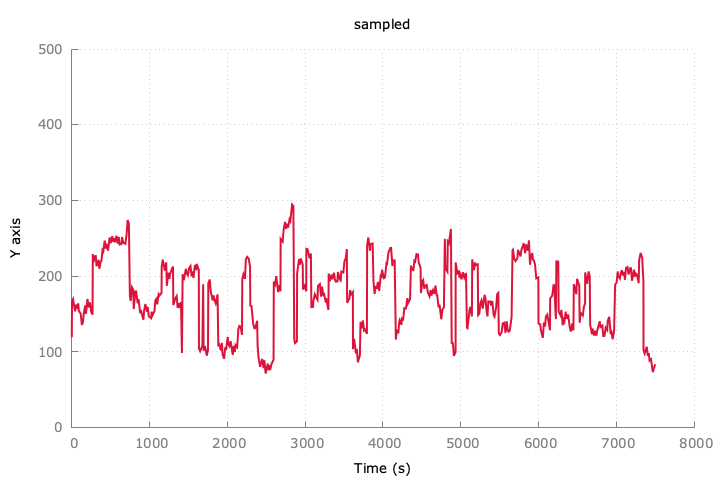

# lttb-sql
sample of PL/PGSQL to implement LTTB algorithm for down sampling

See: https://github.com/sveinn-steinarsson/flot-downsample

## To test the function
```SQL
CREATE TABLE sample_data (
    id SERIAL PRIMARY KEY,
    point_data POINT
);

\COPY sample_data FROM source.csv WITH CSV;

WITH selected_data AS (
    SELECT array_agg(point_data) AS data_array
    FROM sample_data
)

SELECT * FROM largest_triangle_three_buckets(
    (SELECT data_array FROM selected_data),
    500
);
```





